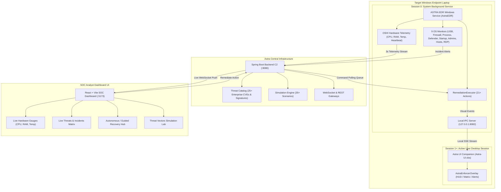

# ASTRA EDR: Complete System Workflow & Operational Guide

---

## 1. System Overview & Core Architecture

**ASTRA (Autonomous Enterprise Threat Intelligence and Endpoint Security Response Platform)** is a full-stack Endpoint Detection and Response (EDR) system. It combines real-time endpoint operating system monitoring, low-level hardware telemetry streaming, centralized AI threat intelligence, and deterministic remote remediation.



---

## 2. Component Directory & Responsibilities

| Component | Technology | Role |
| :--- | :--- | :--- |
| **`windows-agent`** | Java 21, Spring Boot, OSHI, WinSW | Runs as a high-privilege Windows Service (`AstraEDR`) in Session 0. Performs continuous OS scanning, samples CPU/RAM/Temp every 3s, executes containment commands, and serves a local IPC stream. |
| **`User Session Companion`** | Java Swing, VBScript Launcher (`Astra-UI.vbs`) | Runs silently in the logged-in user desktop session. Bridges Session 0 isolation to render interactive visual HUDs and Matrix containment animations on the laptop screen. |
| **`backend`** | Java 21, Spring Boot, PostgreSQL, WebSockets | Central C2 command server. Ingests telemetry, processes incidents against the Threat Catalog, coordinates AI incident explanations, queues remediation commands, and powers the simulation engine. |
| **`frontend`** | React 18, TypeScript, Tailwind CSS, Lucide | Real-time SOC dashboard displaying live hardware gauges, real-time attack visualizers, device status, and interactive remediation workflows. |

---

## 3. How to Install & Manage the Agent

### Prerequisites
* Windows 10/11 (64-bit).
* Java 21 Runtime (JDK/JRE).
* Administrator access.

### One-Click Installation
1. Open the project root directory: `c:\Users\goudk\OneDrive\Desktop\hod\4-2\`.
2. Right-click **`Install-Astra.bat`** and select **"Run as Administrator"** (or execute `Install-Astra.ps1` from an elevated PowerShell terminal).
3. The automated installer will:
   * Create the installation root at `C:\Astra\Agent\` and logs at `C:\Astra\Agent\logs\`.
   * Copy the agent binary `windows-agent.jar` and configuration `AstraEDR.xml`.
   * Register and start the **`AstraEDR`** Windows Service (configured for automatic startup on boot and automatic crash recovery).
   * Register the desktop companion `AstraOverlayCompanion` in `HKLM\...\Run` so the visual HUD starts whenever any user logs in.
   * Immediately launch the `Astra-UI.vbs` companion for the current desktop session.

### One-Click Uninstallation
1. Right-click **`Uninstall-Astra.bat`** and select **"Run as Administrator"**.
2. The uninstaller will:
   * Safely stop and delete the `AstraEDR` Windows Service.
   * Terminate all background agent and companion processes.
   * Remove the Windows startup Run registry entry.
   * Restore default Windows security baselines (re-enable firewall, restore Task Manager policy).
   * Clean up `C:\Astra\`.

---

## 4. How Target Laptop Telemetry Works (CPU, RAM, Temp)

The agent samples low-level system metrics every **3 seconds** using OSHI (Operating System and Hardware Information library):

```
[Target Laptop Hardware] ──(OSHI Sampling every 3s)──> [HardwareTelemetryService]
                                                               │
                                                 POST /api/v1/telemetry/{deviceId}
                                                               │
                                                               ▼
                                                      [Astra Backend C2]
                                                               │
                                                   WebSocket: /topic/telemetry
                                                               │
                                                               ▼
                                                      [Frontend Dashboard]
                                               (Real-time Animated Gauges & Charts)
```

### Metrics Collected:
* **CPU Utilization (%)**: Calculated between processor ticks.
* **RAM Utilization (%) & Available RAM (GB)**: Calculated from total vs available memory.
* **CPU Core Temperature (°C)**: Collected from hardware sensors.
* **Online/Heartbeat Status**: Verified continuously to mark the endpoint as `ONLINE` or `OFFLINE`.

### Where to View on Dashboard:
* Navigate to **Devices** (`/devices`) $\rightarrow$ Click your endpoint (e.g. `NANDU` or `Target-Laptop`).
* View real-time animated gauges, memory consumption meters, and temperature thermal monitors.

---

## 5. How Attacks Work (Real vs Simulated)

ASTRA supports both **real OS attack detection** and **dashboard-controlled simulation testing**:

### Option A: Real Physical & OS Attacks on the Laptop
You or a peer can test real attack techniques directly on the Windows laptop. The agent monitors will immediately detect them:

| Attack Vector | How to Trigger on Target Laptop | How the Agent Detects It |
| :--- | :--- | :--- |
| **USB Intrusion / BadUSB** | Plug any USB flash drive into the laptop. | `USBMonitor` detects new device caption via Windows CIM/WMI and triggers `USBInserted`. |
| **Firewall Tampering** | Run: `Set-NetFirewallProfile -Enabled False` | `FirewallMonitor` detects disabled profile and triggers `FirewallDisabled`. |
| **Malicious Binary Execution** | Run a test binary or script named `mimikatz.exe`, `nc.exe`, or `nmap.exe`. | `ProcessMonitor` scans process trees every 10s and triggers `SuspiciousProcess`. |
| **Startup Persistence** | Drop a `.bat` or `.exe` file into `%APPDATA%\Microsoft\Windows\Start Menu\Programs\Startup\`. | `FileSystemMonitor` catches OS `ENTRY_CREATE` event and triggers `SuspiciousStartup`. |
| **Privilege Escalation** | Run: `net localgroup Administrators HackerUser /add` | `AdministratorMonitor` detects new administrator member and triggers `NewAdministrator`. |
| **Brute-Force Logins** | Trigger 5+ failed Windows password attempts. | `EventLogMonitor` reads Security Event ID 4625 and triggers `EventLogCleared` (Brute Force). |
| **DNS / Hosts Tampering** | Add an entry into `C:\Windows\System32\drivers\etc\hosts`. | `HostsMonitor` detects SHA-256 baseline mismatch and triggers `HostsFileChanged`. |
| **RDP Backdoor** | Enable Remote Desktop via registry (`fDenyTSConnections = 0`). | `RDPMonitor` flags unauthorized RDP opening and triggers `RDPEnabled`. |

---

### Option B: Dashboard Simulation Lab (Threat Vectors Page)
1. Open the SOC Dashboard at `http://localhost:5173/simulation`.
2. Select any of the **35+ Enterprise Threat Scenarios** (e.g. *LockBit 3.0 Ransomware*, *Cobalt Strike Beacon*, *SQL Injection Data Theft*, *BlackCat Exfiltration*).
3. Click **"Trigger Vector"**:
   * The backend registers the incident and generates an AI contextual explanation.
   * An attack payload or notification is dispatched to the target laptop.
   * Real-time radar animations and threat modals pop up on the SOC console.

---

### Option C: Non-Destructive Safe Test Mode
To verify the entire pipeline without modifying files or network settings:
* Send a safe test command via PowerShell:
```powershell
Invoke-RestMethod -Uri "http://localhost:8080/api/v1/devices/6e9bed8e-41ee-4ad1-9304-f8dd9ecb5846/command" -Method POST -Body '{"commandType":"SHOW_TEST_ENFORCEMENT","target":"Safe Verification Event"}' -ContentType "application/json"
```
* The **ASTRA EDR SAFE TEST ENFORCEMENT HUD** pops up centered on the target laptop screen with zero destructive side effects.

---

## 6. How Threat Solving & Remediation Works

When a threat is confirmed, ASTRA can execute autonomous or analyst-approved remediation commands:

```
[SOC Analyst clicks 'Remediate' on Dashboard]
                       │
             POST /api/v1/devices/{id}/command
                       │
                       ▼
             [Astra Backend C2 Queue]
                       │
         Poll Command (/api/v1/agent/commands/{id})
                       │
                       ▼
             [Astra EDR Windows Service]
                       │
            [RemediationExecutor.java]
            ├── 1. Dispatches Visual Event via Local IPC (127.0.0.1:8082)
            │      └── [AstraEnforcerOverlay] renders on user screen
            │
            └── 2. Executes Deterministic OS Enforcement Action:
                   • KILL_PROCESS        -> Force kills malicious process tree
                   • QUARANTINE_FILE     -> Moves malware to C:\Astra\Quarantine\
                   • RESTORE_FIREWALL    -> Re-enables Windows Defender Firewall
                   • ENABLE_REALTIME     -> Turns on Defender Real-Time Protection
                   • ISOLATE_DEVICE      -> Cuts external network to stop lateral movement
                   • RESTORE_NETWORK     -> Re-enables network adapters
                   • DISABLE_USER        -> Disables unauthorized hacker/guest accounts
                   • RESTORE_HOSTS       -> Resets hosts file to default baseline
                   • FULL_DEFENDER_SCAN  -> Launches deep Windows Defender quick scan
```

### The Visual On-Screen Response:
* When remediation triggers, the **`AstraEnforcerOverlay` HUD** pops up on the target laptop screen.
* It displays an animated containment log for the user or presentation audience:
  ```text
  [ASTRA-EDR] Intercepted Remediation Order from C2 Backend...
  [ENFORCE] Command: KILL_PROCESS
  [TARGET]  Target Entity: mimikatz.exe
  [ACTION]  Details: Executing policy enforcement
  [SYSTEM]  Executing system containment protocol...
  [SUCCESS] Threat neutralized. Reporting status back to backend C2.
  ```
* Once complete, the agent reports `COMPLETED` back to the backend, and the SOC dashboard updates the incident status to **RESOLVED**.

---

## 7. Complete Demonstration Flow (Presentation Script)

```
┌────────────────────────────────────────────────────────────────────────────────────────┐
│ STEP 1: START THE PLATFORM                                                             │
│ • Start Backend:    cd backend && mvn spring-boot:run                                  │
│ • Start Dashboard:  cd frontend && npm run dev                                         │
│ • Install Agent:    Run Install-Astra.bat (As Admin) on the target laptop              │
├────────────────────────────────────────────────────────────────────────────────────────┤
│ STEP 2: SHOWCASE LIVE TELEMETRY                                                        │
│ • Open http://localhost:5173/devices on SOC dashboard.                                 │
│ • Observe live CPU load %, RAM %, and Temperature streaming in real-time every 3s.     │
├────────────────────────────────────────────────────────────────────────────────────────┤
│ STEP 3: SIMULATE / EXECUTE AN ATTACK                                                   │
│ • Live Attack: Plug in a USB or turn off Windows Firewall on target laptop.            │
│ • OR Dashboard Attack: Go to /simulation, select 'Ransomware', and click 'Trigger'.    │
├────────────────────────────────────────────────────────────────────────────────────────┤
│ STEP 4: SOC ALERT & AI ANALYSIS                                                        │
│ • Dashboard instantly plays alert audio and displays the glowing red Threat Modal.     │
│ • AI Incident Brief explains the attack mechanism, MITRE ATT&CK tactic, and risk.      │
├────────────────────────────────────────────────────────────────────────────────────────┤
│ STEP 5: REMEDIATION & VISUAL HUD ENFORCEMENT                                           │
│ • Click 'Remediate' (or execute recovery step) on the dashboard.                       │
│ • Look at target laptop: AstraEnforcerOverlay HUD visibly pops up with live typing.    │
│ • Target laptop firewall is restored / malicious process is killed / file quarantined. │
│ • Dashboard marks incident as RESOLVED.                                                │
└────────────────────────────────────────────────────────────────────────────────────────┘
```
