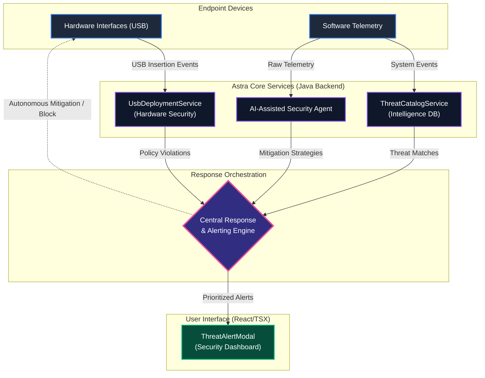
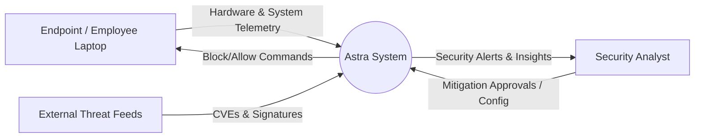
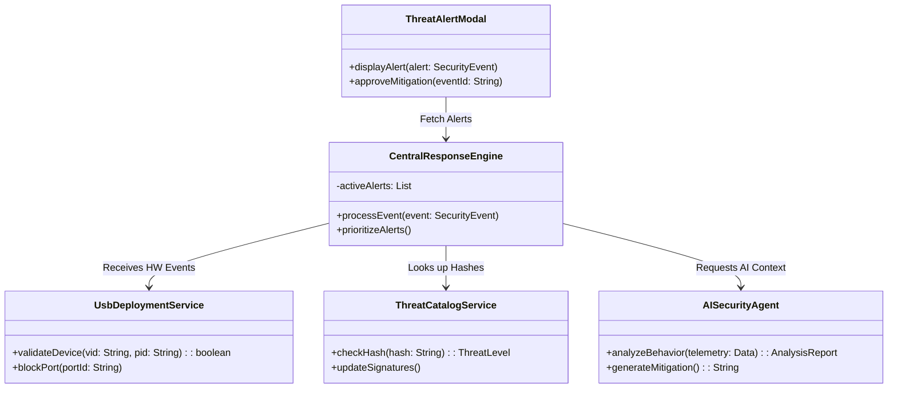
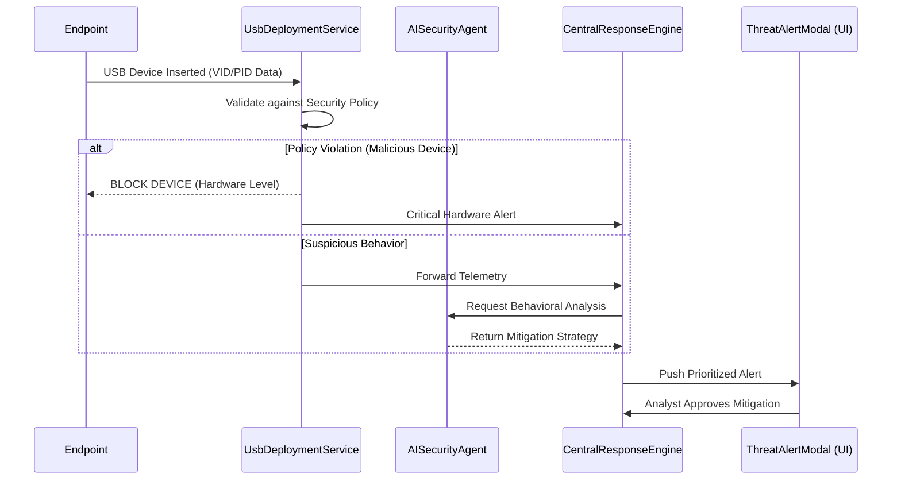
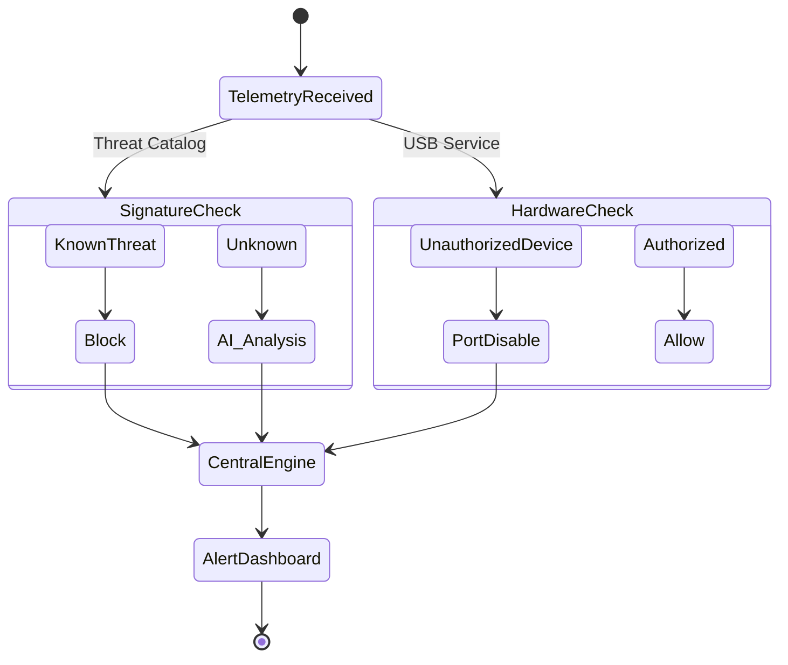

# ASTRA: Comprehensive Technical Project Report
**Autonomous Enterprise Threat Intelligence and Endpoint Security Response Platform**

---

## 1. Introduction
Modern enterprise networks face increasingly sophisticated threats that target endpoints and hardware interfaces. Traditional security platforms often rely on fragmented software agents and manual threat analysis, resulting in delayed response times and limited visibility into hardware-level vectors such as malicious USB devices (e.g., BadUSB). To address these vulnerabilities, **Astra** provides an Autonomous Enterprise Threat Intelligence and Endpoint Security Response Platform. 

Astra integrates deterministic hardware controls with advanced AI-assisted threat analysis, offering a comprehensive, multi-layered defense mechanism that secures both physical and digital endpoints.

---

## 2. Problem Statement and Objectives
### Problem Statement
Existing security operations involve significant manual effort to triage alerts, while individual security tools generally focus on specific attack vectors. Hardware management tools enforce access controls, and software agents monitor file behaviors, but their outputs are often fragmented. AI tools can provide contextual threat analysis but cannot enforce physical security policies directly. A unified mechanism is required to collect telemetry, evaluate its severity against a central threat catalog, prioritize incidents, and respond autonomously.

### Objectives
1. **Automated Hardware Security:** Actively manage and monitor endpoint hardware interfaces, specifically USB deployment, preventing data exfiltration and physical attacks.
2. **Threat Intelligence Integration:** Maintain a centralized Threat Catalog Service to identify known malicious patterns across the enterprise.
3. **AI-Assisted Security Analysis:** Utilize AI-based reasoning to analyze incident context and provide rapid mitigation recommendations.
4. **Alert Consolidation:** Aggregate security events, filter false positives, and prioritize true threats.

---

## 3. Overall System Architecture

The Astra platform distributes security monitoring across specialized services: the Hardware Security module, Threat Catalog, and AI Security Agent, all feeding into a Central Response Engine.

**Fig. 1. Overall architecture of the proposed Astra enterprise threat intelligence platform.**



---

## 4. Hardware Security & USB Deployment
At the core of Astra’s physical defense is the `UsbDeploymentService`. 
* **Vulnerability Mitigated:** BadUSB attacks, rubber duckies, and unauthorized mass storage data exfiltration.
* **Mechanism:** When a USB device is inserted into an endpoint, the hardware telemetry agent intercepts the device descriptors (Vendor ID, Product ID, Class). The `UsbDeploymentService` evaluates these against organizational policies. If a device masquerades as a keyboard but executes rapid keystrokes (classic BadUSB behavior), the service immediately terminates the connection at the kernel/driver level and flags a critical hardware alert to the Central Response Engine.

## 5. Software Components
* **Backend:** Developed in Java (Spring Boot). It houses the REST APIs, orchestrates the `ThreatCatalogService`, manages JWT-based `AuthResponse` for administrators, and handles secure communication with endpoints.
* **Frontend:** Developed in React with TypeScript (`.tsx`). The main component for incident management is the `ThreatAlertModal.tsx`, which provides a real-time, interactive dashboard for security analysts to view AI insights and approve or deny mitigation actions.

## 6. AI Integration & Threat Catalog
* **ThreatCatalogService:** A high-speed database holding CVEs, zero-day signatures, and malware hashes.
* **AI Security Agent:** When an anomaly is detected that doesn't match a strict signature, the AI agent analyzes the behavioral telemetry. It translates raw logs into human-readable narratives (e.g., "Powershell executed a hidden encoded command attempting to reach a known malicious IP").

---

## 7. System Modeling & Diagrams

### 7.1 Data Flow Diagram (Level-0)
This diagram illustrates the high-level flow of data between the external entities and the Astra system.

**Fig. 2. Level-0 data flow diagram of the Astra endpoint security platform.**



### 7.2 Class Diagram
This diagram outlines the core backend classes and their relationships.

**Fig. 3. Class diagram of the proposed Astra threat response system.**



### 7.3 Use Case Diagram
This diagram shows the interactions between the Security Analyst, the Employee Endpoint, and the Astra platform.

**Fig. 4. Use case diagram of the Astra enterprise security system.**

```mermaid
usecaseDiagram
    actor "Security Analyst" as SA
    actor "Endpoint (Employee)" as EP
    
    rectangle "Astra Platform" {
        usecase "Insert USB Device" as UC1
        usecase "Monitor Hardware Telemetry" as UC2
        usecase "Analyze with AI" as UC3
        usecase "View Threat Alerts" as UC4
        usecase "Enforce Device Policy" as UC5
    }
    
    EP --> UC1
    UC1 ..> UC2 : triggers
    UC2 ..> UC5 : automatically executes
    UC2 ..> UC3 : sends complex data
    UC3 ..> UC4 : generates insight
    SA --> UC4
    SA --> UC5 : manual override
```

### 7.4 Sequence Diagram
This diagram illustrates the chronological step-by-step interaction when a malicious USB is inserted.

**Fig. 5. Sequence diagram illustrating the interaction among system components during threat analysis and mitigation.**



### 7.5 Activity Diagram
This diagram shows the decision workflow when an event enters the system.

**Fig. 6. Activity diagram of the proposed Astra autonomous response workflow.**



---

## 8. Implementation Details
* **Security & Authentication:** The system relies on the `AuthResponse.java` DTO to ensure robust token-based authentication. Only authenticated security personnel can view the dashboard or approve manual mitigations.
* **Hardware Integration:** The endpoints run a lightweight daemon that hooks into the OS device manager (e.g., Windows WMI or Linux udev) to intercept USB connection events in milliseconds before the OS mounts the volume.
* **Dashboard:** The `ThreatAlertModal.tsx` uses modern React state management to instantly pop up high-priority alerts with glowing indicators (red for critical, yellow for warning), preventing alert fatigue by consolidating duplicate events.

## 9. Conclusion
Astra represents a modern paradigm in enterprise cybersecurity. By fusing rigid, deterministic hardware controls (USB Deployment) with contextual, natural-language AI reasoning and a central threat catalog, the platform provides security operations centers (SOCs) with unmatched visibility and response times. The architecture is modular, scalable, and designed to adapt to the ever-evolving landscape of cyber threats.
